# Brazil E-Commerce Analytics Warehouse Using Snowflake and PowerBI

End-to-end Snowflake, SQL and Power BI analytics project using the Olist Brazilian E-Commerce dataset.

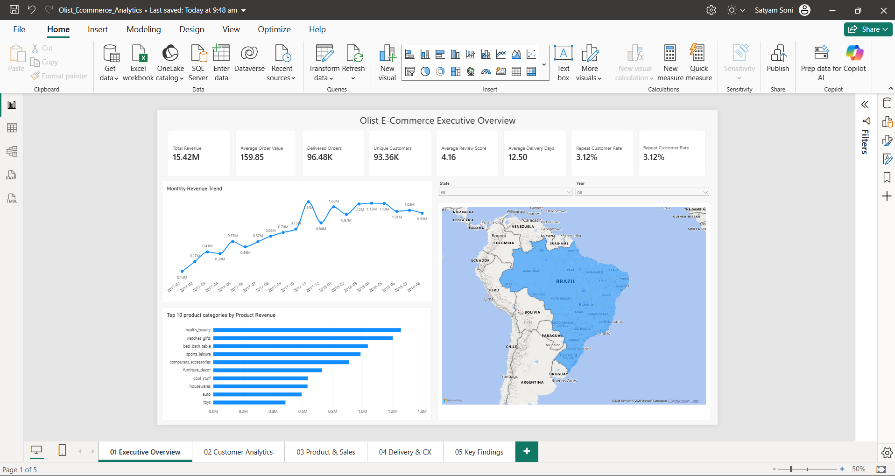

---

## Project Overview

This project presents an end-to-end analysis of the **Olist Brazilian E-Commerce dataset** using Snowflake, SQL, and Power BI.

The objective was to transform raw e-commerce data into a structured analytical model and use it to answer business questions related to:

- Sales performance
- Customer behavior
- Product performance
- Customer retention
- Logistics
- Delivery performance
- Customer experience

The workflow covers data ingestion into Snowflake, layered transformation through **RAW, STAGING, and ANALYTICS schemas**, dimensional modeling, SQL-based business analysis, RFM customer segmentation, and interactive Power BI dashboards.

---

## Architecture

```text
Olist CSV Files
        ↓
Snowflake Internal Stage
        ↓
RAW Schema
        ↓
STAGING Schema
        ↓
ANALYTICS Schema
        ↓
Power BI Import Model
        ↓
DAX Measures
        ↓
Interactive Dashboards & Business Insights
```

The project follows a layered warehouse design:

- **RAW** — preserves source data with minimal changes.
- **STAGING** — standardizes fields, handles data quality issues, and creates analytical attributes.
- **ANALYTICS** — contains fact tables, dimensions, and customer segmentation tables used by Power BI.

---

## Tech Stack

- **Snowflake**
- **SQL**
- **Power BI Desktop**
- **DAX**
- **Power Query**
- **GitHub**
- **CSV**

---

## Business Questions

The analysis was designed to answer questions such as:

- How much order value and sales volume did the marketplace generate?
- Which product categories generated the highest revenue?
- Which categories sold the highest number of items?
- How many customers made repeat purchases?
- Which customer segments are most valuable?
- Which regions experience the highest delivery delays?
- Which product categories have higher delivery-risk levels?
- Is late delivery associated with lower customer review scores?
- How significant is freight cost across product categories?
- Where are the largest customer-retention and logistics opportunities?

---

## Source Data

The project uses the public **Olist Brazilian E-Commerce dataset**.

The source consists of nine CSV datasets covering:

- Customers
- Orders
- Order items
- Payments
- Reviews
- Products
- Sellers
- Geolocation
- Product category translations

Some important source-data characteristics identified during profiling included:

- Approximately **99K orders**
- More than **112K order-item records**
- More than **103K payment records**
- Approximately **1 million geolocation records**
- Multiple payment records can exist for one order
- Multiple items can exist within one order
- Geolocation contains many repeated ZIP-prefix observations
- `customer_unique_id` is required to identify recurring customers across orders

---

## Snowflake Data Architecture

The Snowflake environment was structured using three schemas:

```text
ECOMMERCE_DB
│
├── RAW
├── STAGING
└── ANALYTICS
```

### RAW Layer

The RAW layer mirrors the source CSV structure and preserves the original data as closely as possible.

The data was loaded using:

- Named internal stage
- Reusable CSV file format
- `COPY INTO`
- Validation before loading
- Controlled error handling

### STAGING Layer

The STAGING layer was used to:

- Standardize city and state fields
- Normalize order status values
- Convert and validate timestamps
- Translate product categories
- Correct source naming inconsistencies
- Calculate delivery metrics
- Consolidate geolocation observations
- Prepare clean records for dimensional modeling

### ANALYTICS Layer

The ANALYTICS layer contains the business-ready dimensional model used by Power BI.

---

## Data Model

Different business processes exist at different levels of detail, so separate fact tables were used.

### Dimension Tables

- `DIM_CUSTOMER`
- `DIM_PRODUCT`
- `DIM_SELLER`
- `DIM_LOCATION`
- `DIM_DATE`

### Fact Tables

- `FACT_ORDERS`
- `FACT_ORDER_ITEMS`
- `FACT_PAYMENTS`

### Analytical Table

- `RFM_CUSTOMERS`

Separating the fact tables prevents **row multiplication and incorrect aggregation**.

For example, an order containing two items and two payment records should not be joined directly into four rows for revenue analysis.

Instead, each process is modeled at its correct grain.

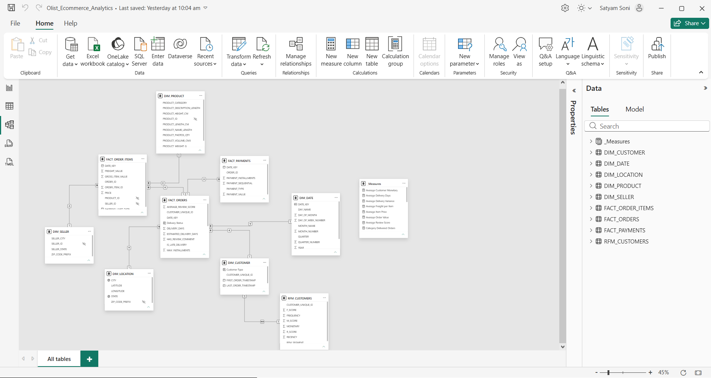

---

## Important Data Modeling Decisions

### Customer Identity

The source contains both:

- `customer_id`
- `customer_unique_id`

`customer_id` represents an order-level customer record, while `customer_unique_id` represents the same customer across multiple purchases.

Therefore, recurring-customer analysis was based on:

```text
customer_unique_id
```

---

### Geolocation Consolidation

The raw geolocation dataset contains approximately **1 million rows**, but only around **19K unique ZIP prefixes**.

Joining the raw table directly to orders would therefore create duplicate rows.

The data was consolidated to approximately one representative record per ZIP prefix using aggregated latitude/longitude and representative city/state information.

---

### Multiple Payments Per Order

One order can contain several payment components.

Payment records were aggregated before being attached to the order-level fact table.

This preserves:

```text
1 row = 1 order
```

inside `FACT_ORDERS`.

---

### Multiple Reviews

Orders can also contain multiple review records.

Reviews were summarized before joining them to the order-level model to prevent duplicate orders.

---

## Data Preparation Highlights

Key transformations included:

- Loaded all nine source datasets into Snowflake
- Created RAW, STAGING, and ANALYTICS layers
- Standardized geographic and categorical fields
- Converted timestamps into analytical date fields
- Created order year, month, quarter, and date attributes
- Calculated delivery duration
- Created late-delivery indicators
- Translated product categories to English
- Handled missing product categories
- Consolidated approximately 1 million geolocation records
- Used `customer_unique_id` for recurring-customer analysis
- Built a continuous date dimension
- Aggregated payments before order-level joins
- Aggregated review information before order-level joins
- Created customer lifetime-order metrics
- Built RFM customer segmentation

---

## RFM Customer Segmentation

An RFM model was created using:

- **Recency** — days since the customer's latest delivered order
- **Frequency** — number of delivered orders
- **Monetary** — total order value

Customer segments included:

- Champions
- Loyal Customers
- Potential Loyalists
- Recent Customers
- Needs Attention
- At Risk
- Hibernating

A distribution-aware frequency scoring method was used because the majority of customers placed only one observed order.

This prevented one-time customers from incorrectly receiving high frequency scores.

---

# Dashboard

The Power BI report contains five main pages.

---

## 1. Executive Overview


Provides a high-level view of:

- Total payment value
- Delivered orders
- Unique customers
- Average order value
- Review score
- Delivery performance
- Repeat purchasing
- Monthly trends
- Product-category performance
- Geographic performance

---

## 2. Customer Analytics

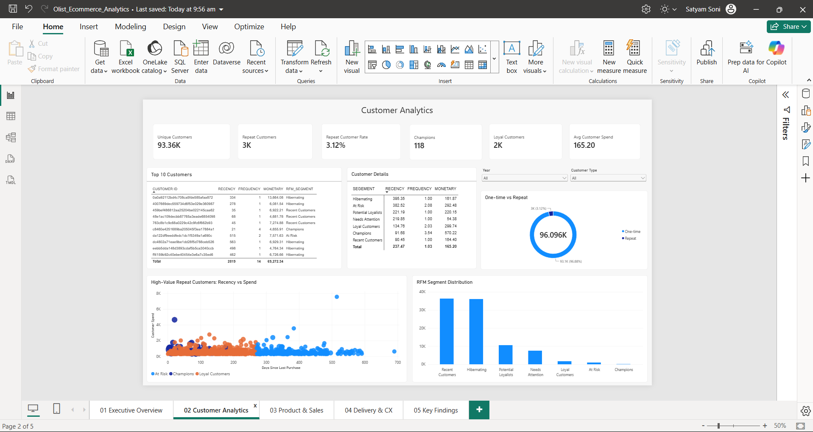

Focuses on:

- Unique customers
- Repeat customers
- Repeat customer rate
- RFM customer segmentation
- Champions
- Loyal customers
- Customer monetary value
- One-time vs repeat behavior
- High-value repeat customers

---

## 3. Product & Sales Analytics

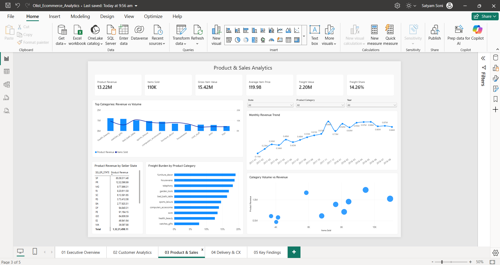

Analyzes:

- Product revenue
- Items sold
- Gross item value
- Average item price
- Freight value
- Freight share
- Category revenue vs sales volume
- Seller-state performance
- Category freight burden
- Monthly revenue trends

---

## 4. Delivery & Customer Experience

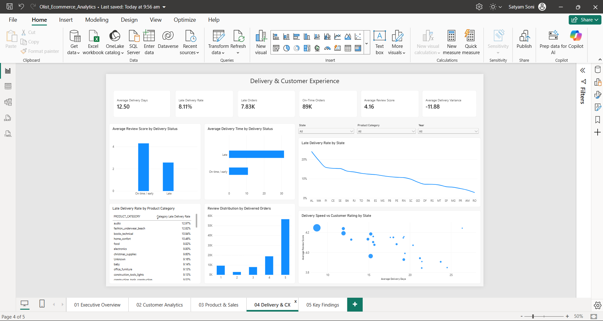

Examines:

- Average delivery duration
- Late-delivery rate
- Late orders
- On-time orders
- Average review score
- Delivery variance
- Review score by delivery status
- Delivery duration by delivery status
- State-level delivery performance
- Product-category late-delivery rates
- Delivery speed vs customer ratings

---

## 5. Key Findings

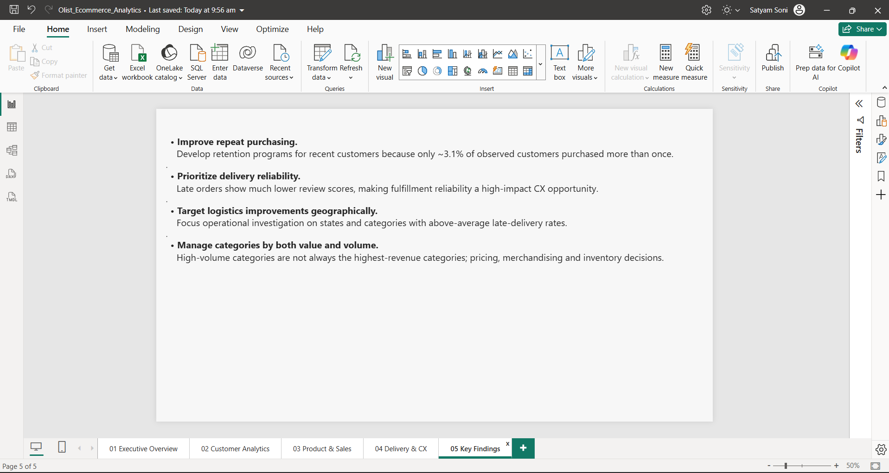

Summarizes the major business insights and recommendations derived from the analysis.

---

# Key KPIs

| Metric | Result |
|---|---:|
| Delivered Orders | ~96.5K |
| Unique Customers | ~93.4K |
| Total Payment Value | ~15.42M |
| Average Order Value | ~159.85 |
| Average Review Score | ~4.16 |
| Average Delivery Time | ~12.50 days |
| Late Delivery Rate | ~8.11% |
| Repeat Customer Rate | ~3.12% |

---

# Key Findings

## 1. Customer retention is limited

Only approximately **3.1% of observed customers** placed more than one order during the available dataset period.

The customer base is therefore dominated by one-time purchasing behavior.

This represents one of the largest commercial opportunities identified in the project.

---

## 2. Delivery reliability is strongly associated with customer satisfaction

Average review score:

```text
On-time / early orders: ~4.29
Late orders:            ~2.57
```

Late orders therefore received review scores approximately **1.7 points lower** on average.

This is an association observed in the dataset and does not by itself establish causation.

---

## 3. Late orders experience substantially longer delivery times

Average delivery duration:

```text
On-time / early: ~10.8 days
Late:            ~31.5 days
```

Late orders therefore took roughly **20 additional days** compared with on-time or early deliveries.

---

## 4. Delivery estimates were generally conservative

Average delivery variance was approximately:

```text
-11.9 days
```

This indicates that orders were typically delivered earlier than the estimated delivery date.

However, the smaller set of orders that exceeded the expected delivery date experienced substantially worse customer ratings.

---

## 5. Sales volume and revenue tell different stories

The highest-volume product categories were not always the highest-revenue categories.

This means category performance should be evaluated using both:

- Units sold
- Revenue generated

rather than relying on sales volume alone.

---

## 6. Customer value is concentrated

The RFM model showed that genuinely high-frequency customers form only a small proportion of the customer base.

Examples include:

```text
Champions:          ~118
Loyal Customers:  ~1.7K
```

while Recent and Hibernating customer groups contain tens of thousands of customers.

---

## 7. Logistics performance varies geographically

Late-delivery rates differ considerably by state.

Some regions show substantially higher delivery delays than the national average, suggesting that logistics improvement should be geographically targeted rather than managed only at national level.

---

## 8. Freight burden varies by product category

Freight represents a meaningful component of total item value.

Some categories experience materially higher freight burden than others, which may affect pricing, seller strategy, and fulfillment decisions.

---

# Business Recommendations

### Improve repeat purchasing

Develop retention campaigns targeting recent customers and encourage a second purchase before customers become inactive.

---

### Prioritize delivery reliability

Because delayed deliveries are associated with substantially lower customer ratings, reducing delivery failures should be treated as a customer-experience priority.

---

### Target logistics improvements geographically

Investigate fulfillment constraints in states showing consistently elevated late-delivery rates.

---

### Use RFM segmentation for targeted engagement

Different customer groups should receive different treatment.

For example:

- Champions → loyalty / VIP engagement
- Recent Customers → second-purchase campaigns
- At Risk → reactivation campaigns
- Hibernating → selective win-back campaigns

---

### Evaluate categories using value and volume

Merchandising and inventory decisions should consider both:

- Revenue
- Sales volume
- Freight burden

rather than ranking products using only one metric.

---

# Snowflake Implementation

The Snowflake environment included several practical platform features.

### Compute

- X-Small virtual warehouse
- Auto-resume enabled
- 60-second auto-suspend
- Resource monitor for cost control

### Security

A custom:

```text
ECOMMERCE_DEVELOPER
```

role was created for regular project development rather than relying entirely on administrative roles.

### Data Ingestion

The ingestion process used:

- Named internal stage
- Reusable CSV file format
- `COPY INTO`
- Load validation
- Controlled error handling

### Warehouse Design

```text
RAW
   ↓
STAGING
   ↓
ANALYTICS
```

This separation keeps source data, transformations, and business-ready analytical models logically isolated.

---

## Snowflake Implementation 

### Database Architecture

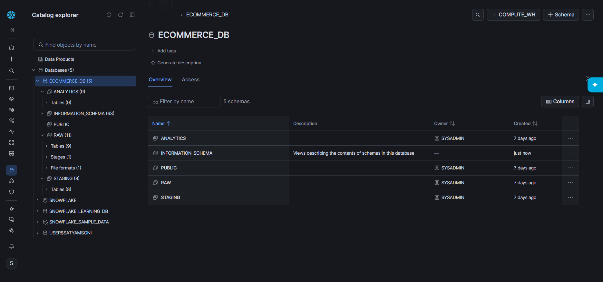

### Analytics Schema

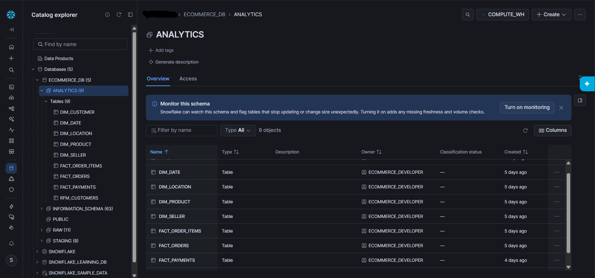

### Warehouse Configuration

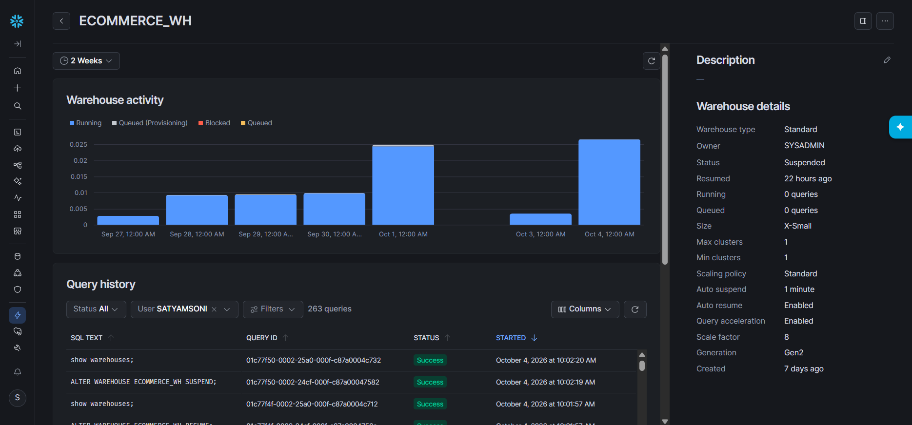

### Resource Monitor

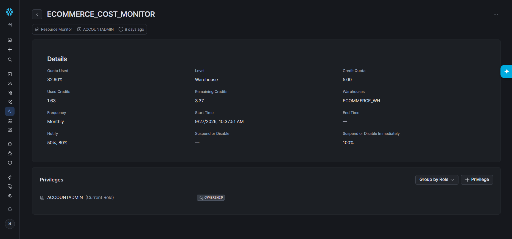

### RBAC

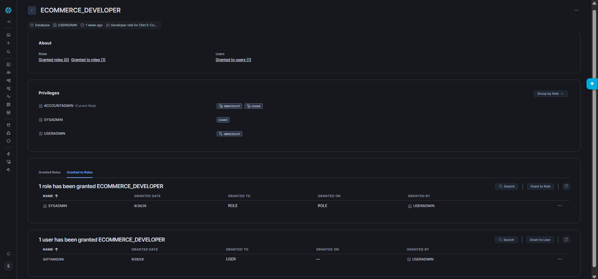

### Internal Stage

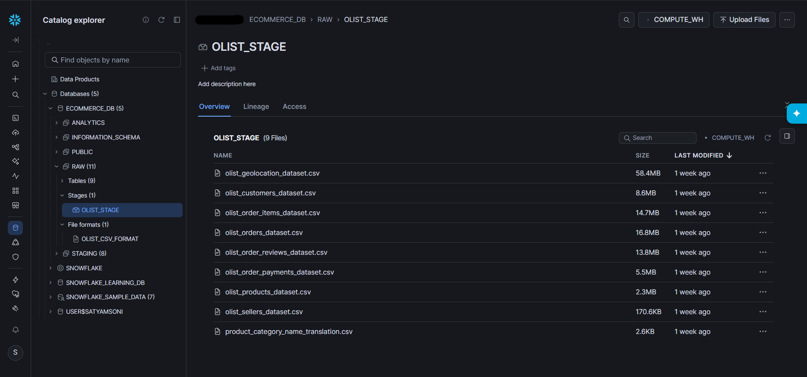

### CSV File Format

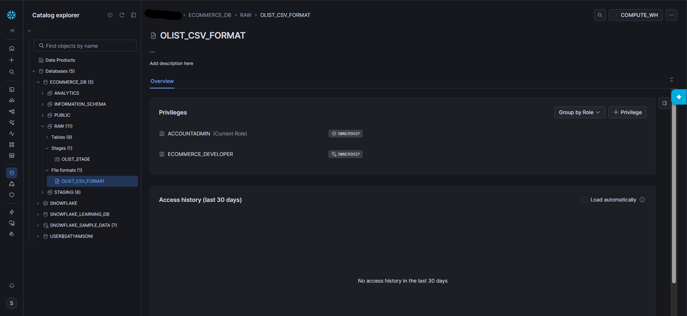

---

# SQL Scripts

The repository contains the SQL used to build and analyze the project.

```text
sql/
│
├── 01_environment_setup.sql
├── 02_rbac_and_cost_control.sql
├── 03_ingestion_setup.sql
├── 04_raw_tables_and_loading.sql
├── 05_staging_transformations.sql
├── 06_analytics_dimensions.sql
├── 07_analytics_facts.sql
├── 08_rfm_segmentation.sql
└── 09_business_analysis.sql
```

These scripts cover the complete analytical workflow from Snowflake environment configuration through final business analysis.

---

# Repository Structure

```text
olist-ecommerce-analytics/
│
├── README.md
│
├── sql/
│   ├── 01_environment_setup.sql
│   ├── 02_rbac_and_cost_control.sql
│   ├── 03_ingestion_setup.sql
│   ├── 04_raw_tables_and_loading.sql
│   ├── 05_staging_transformations.sql
│   ├── 06_analytics_dimensions.sql
│   ├── 07_analytics_facts.sql
│   ├── 08_rfm_segmentation.sql
│   └── 09_business_analysis.sql
│
├── powerbi/
│   ├── 01_executive_overview.png
│   ├── 02_customer_analytics.png
│   ├── 03_product_sales.png
│   ├── 04_delivery_customer_experience.png
│   ├── 05_key_findings.png
│   └── 06_data_model.png
│
└── snowflake/
    ├── 01_database_architecture.png
    ├── 02_analytics_schema.png
    ├── 03_warehouse_configuration.png
    ├── 04_resource_monitor.png
    ├── 05_rbac_developer_role.png
    ├── 06_internal_stage.png
    └── 07_csv_file_format.png
```

---

# Limitations

- The dataset covers a limited historical period and should not be interpreted as lifetime customer behavior.
- Repeat-customer rate represents repeat purchasing observed within the available dataset window.
- The dataset does not include full product-cost or operating-cost information, so profitability cannot be calculated.
- Total payment value should therefore not be interpreted as profit.
- The association between delivery delays and customer ratings does not establish causation.
- Some source product-category and geographic fields contain missing or imperfect information.
- Dataset boundary months are incomplete, so trend comparisons were restricted when appropriate.
- Historical marketplace growth means year-over-year differences should not automatically be interpreted as seasonality.

---

# What I Learned

This project provided practical experience with:

- End-to-end analytical project development
- Snowflake warehouse configuration
- Role-based access control
- Cost management
- Internal stages and bulk loading
- Multi-layer data transformation
- Data-quality analysis
- Dimensional modeling
- Fact-table grain management
- SQL analytics
- RFM segmentation
- Power BI semantic modeling
- DAX measures
- Cross-table filtering challenges
- Dashboard design
- Business insight generation
- Translating technical analysis into recommendations

---

## Author


**Satyam Soni**


Data Analytics Portfolio Project
